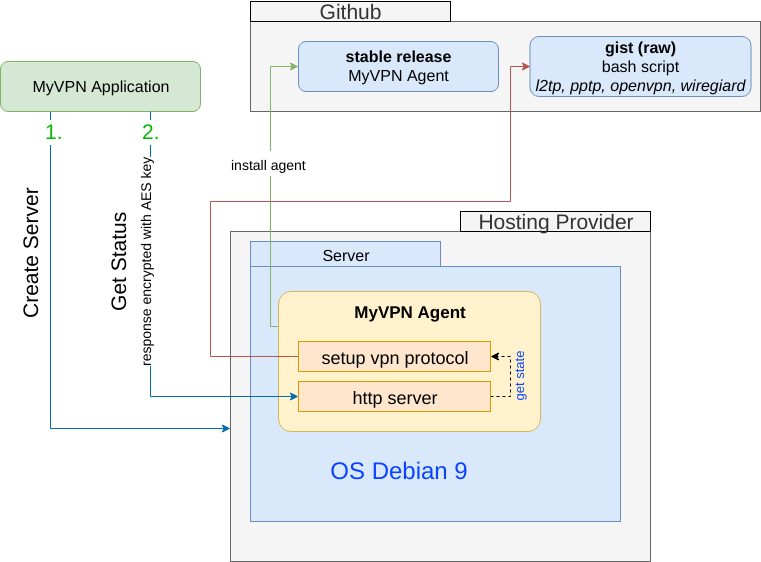

# MyVPN Agent

Utility to install and configure VPN protocols on the server

### Features

* Setup VPN protocols
* HTTP server gives the setup status and vpn configuration with AES encryption (ports: `8400` or `80`)

### Layer Interaction

### Environment

* `VPN_TYPE` name of protocol to be installed `l2tp`, `pptp`, `openvpn`, `shadowsocks` or `wireguard`
* `ENCRYPT_KEY` random AES key (32 characters)
* `VPN_CLIENT_CONFIG_FILE` a place to save the client connection config. `default: /tmp/myvpn-client-config`
* `DEBUG_AGENT` debug mode `(default: disabled)`
* `DNS_PRIMARY` default: OpenDNS `208.67.222.222`
* `DNS_SECONDARY` default: OpenDNS `208.67.220.220`